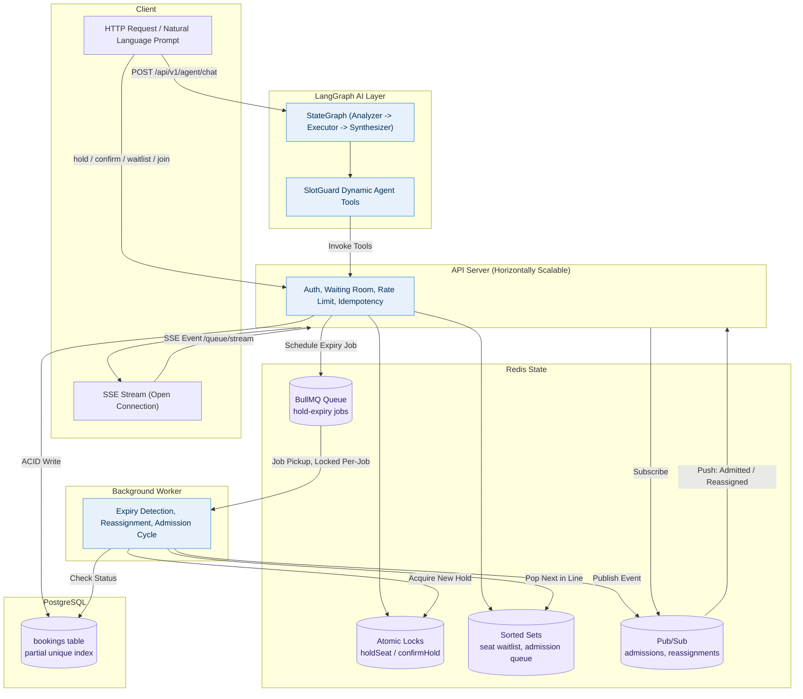
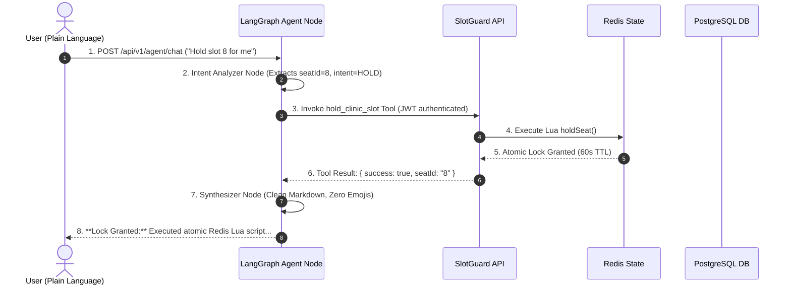
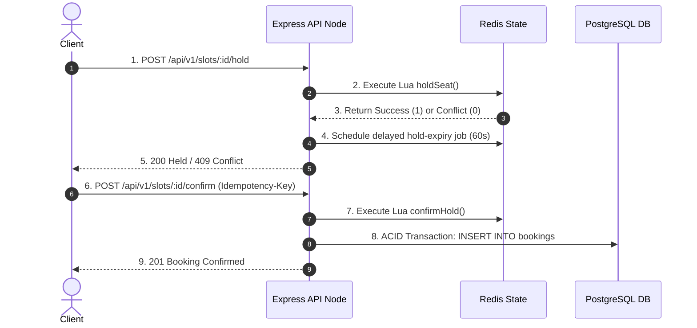
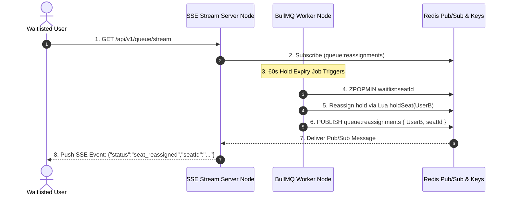

# SlotGuard

A distributed, high-concurrency seat/resource booking engine built to eliminate race conditions under real concurrent load, with automatic fair waitlisting, real-time SSE event notifications, demand-spike admission control, and an intelligent **LangGraph AI Clinic Booking Agent**.

## System Architecture

### Overview


```mermaid
flowchart TD
    subgraph Client["Client"]
        C1["HTTP Request / Natural Language Prompt"]
        C2["SSE Stream (Open Connection)"]
    end

    subgraph Agent["LangGraph AI Layer"]
        LG["StateGraph (Analyzer -> Executor -> Synthesizer)"]
        ST["SlotGuard Dynamic Agent Tools"]
    end

    subgraph API["API Server (Horizontally Scalable)"]
        MW["Auth, Waiting Room, Rate Limit, Idempotency"]
    end

    subgraph Redis["Redis State"]
        RL[("Atomic Locks<br/>holdSeat / confirmHold")]
        RQ[("Sorted Sets<br/>seat waitlist, admission queue")]
        RP[("Pub/Sub<br/>admissions, reassignments")]
        RB[("BullMQ Queue<br/>hold-expiry jobs")]
    end

    subgraph Worker["Background Worker"]
        WJ["Expiry Detection, Reassignment, Admission Cycle"]
    end

    subgraph DB["PostgreSQL"]
        PB[("bookings table<br/>partial unique index")]
    end

    C1 -->|"POST /api/v1/agent/chat"| LG
    LG --> ST
    ST -->|"Invoke Tools"| MW
    
    C1 -->|"hold / confirm / waitlist / join"| MW
    MW --> RL
    MW --> RQ
    MW -->|"Schedule Expiry Job"| RB
    MW -->|"ACID Write"| PB

    C2 -->|"GET /queue/stream"| API
    API -->|"Subscribe"| RP
    RP -->|"Push: Admitted / Reassigned"| API
    API -->|"SSE Event"| C2

    RB -->|"Job Pickup, Locked Per-Job"| WJ
    WJ -->|"Check Status"| PB
    WJ -->|"Pop Next in Line"| RQ
    WJ -->|"Acquire New Hold"| RL
    WJ -->|"Publish Event"| RP

    classDef store fill:#efe9ff,stroke:#7f77dd,color:#26215c
    classDef compute fill:#e6f1fb,stroke:#378add,color:#042c53
    class RL,RQ,RP,RB,PB store
    class MW,WJ,LG,ST compute
```

### Core Execution Flows

#### 1. LangGraph AI Agent Booking Flow

```mermaid
sequenceDiagram
    autonumber
    actor User as User (Plain Language)
    participant Agent as LangGraph Agent Node
    participant API as SlotGuard API
    participant Redis as Redis State
    participant DB as PostgreSQL DB

    User->>Agent: 1. POST /api/v1/agent/chat ("Hold slot 8 for me")
    Agent->>Agent: 2. Intent Analyzer Node (Extracts seatId=8, intent=HOLD)
    Agent->>API: 3. Invoke hold_clinic_slot Tool (JWT authenticated)
    API->>Redis: 4. Execute Lua holdSeat()
    Redis-->>API: 5. Atomic Lock Granted (60s TTL)
    API-->>Agent: 6. Tool Result: { success: true, seatId: "8" }
    Agent->>Agent: 7. Synthesizer Node (Clean Markdown, Zero Emojis)
    Agent-->>User: 8. **Lock Granted:** Executed atomic Redis Lua script...
```

#### 2. Seat Hold & Confirmation Flow

```mermaid
sequenceDiagram
    autonumber
    actor User as Client
    participant API as Express API Node
    participant Redis as Redis State
    participant DB as PostgreSQL DB

    User->>API: 1. POST /api/v1/slots/:id/hold
    API->>Redis: 2. Execute Lua holdSeat()
    Redis-->>API: 3. Return Success (1) or Conflict (0)
    API->>Redis: 4. Schedule delayed hold-expiry job (60s)
    API-->>User: 5. 200 Held / 409 Conflict

    User->>API: 6. POST /api/v1/slots/:id/confirm (Idempotency-Key)
    API->>Redis: 7. Execute Lua confirmHold()
    API->>DB: 8. ACID Transaction: INSERT INTO bookings
    API-->>User: 9. 201 Booking Confirmed
```

#### 3. Hold Expiry, Waitlist Reassignment & SSE Event Push Flow

```mermaid
sequenceDiagram
    autonumber
    actor UserB as Waitlisted User
    participant SSE as SSE Stream Server Node
    participant Worker as BullMQ Worker Node
    participant Redis as Redis Pub/Sub & Keys

    UserB->>SSE: 1. GET /api/v1/queue/stream
    SSE->>Redis: 2. Subscribe (queue:reassignments)

    Note over Worker: 3. 60s Hold Expiry Job Triggers
    Worker->>Redis: 4. ZPOPMIN waitlist:seatId
    Worker->>Redis: 5. Reassign hold via Lua holdSeat(UserB)
    Worker->>Redis: 6. PUBLISH queue:reassignments { UserB, seatId }
    Redis-->>SSE: 7. Deliver Pub/Sub Message
    SSE-->>UserB: 8. Push SSE Event: {"status":"seat_reassigned","seatId":"..."}
```

## Core Features

- **LangGraph AI Agent**: Natural language clinic slot booking interface built with `@langchain/langgraph`. Integrates tools (`hold_clinic_slot`, `confirm_clinic_booking`, `join_slot_waitlist`, `get_available_slots`, `join_waiting_room`) that interface directly with atomic Redis Lua locks and PostgreSQL ACID transactions. Formatted to return strictly human-readable Markdown text with zero emojis.
- **Atomic Locking**: Single-threaded Redis Lua scripts (`holdSeat`, `confirmHold`) make seat holds and confirmations atomic, preventing race conditions under high concurrent requests.
- **Database Backstop**: A PostgreSQL partial unique index (`WHERE status = 'CONFIRMED'`) guarantees zero duplicate confirmed bookings, even if Redis state drifts.
- **Idempotent Retries**: Idempotency-key middleware ensures safe request retries after network failures, preventing duplicate confirmations.
- **Rate Limiting**: A microsecond-precision Token Bucket rate limiter (Redis Lua) throttles per-user request bursts without server crashes.
- **Automatic Waitlist Reassignment**: Expired holds are detected via BullMQ delayed jobs (no polling). If a hold expires unclaimed, the next user on a Redis sorted-set waitlist is automatically reassigned the seat, with a new expiry cycle scheduled for them.
- **Real-Time SSE Event Streaming**: Live event stream (`GET /api/v1/queue/stream`) pushes instant status updates to clients (e.g. `seat_reassigned`, `admitted`) via Redis Pub/Sub without polling overhead.
- **Virtual Waiting Room**: Optional admission-control layer that queues users fairly (FIFO, Redis sorted set) and admits them in controlled batches at a fixed interval.
- **High-Contrast Dark Mode UI**: 13g.fr inspired brutalist design featuring Electric Cyber Blue typography, interactive radial gauges, matrix seat pods, and live SSE terminals.

## Tech Stack

Node.js, Express, LangGraph (`@langchain/langgraph`, `@langchain/core`), Redis (ioredis, Lua scripting, Pub/Sub), PostgreSQL, BullMQ, Server-Sent Events (SSE), JWT, HTML5/CSS3/Vanilla JS.

## Verified Benchmarks & Metrics

- **Throughput & Capacity (1,000 Concurrent VUs)**:
  - **Throughput**: **`825.11 req/sec`**
  - **Success Rate**: **`100.00%`** (1,000 / 1,000 succeeded)
  - **Error Rate**: **`0.00%`**
  - **Avg Latency**: **`662.47 ms`**
  - **p90 / p95 Latency**: **`1.02 s`** / **`1.07 s`**
  - **Min Latency**: **`149.49 ms`**

- **Race Condition & Single-Seat Lock Precision (50 Simultaneous VUs)**:
  - **Contention**: 50 simultaneous VUs racing for the exact same seat ID
  - **Lock Precision**: **`100.00%`** (Exactly **1** hold granted, **49** instantly rejected with `409 Conflict`)
  - **Winner Lock Latency**: **`13.76 ms`**
  - **Double-Booking Error Rate**: **`0.00%`**

## API Endpoints

| Method | Endpoint | Description |
|---|---|---|
| POST | `/api/v1/agent/chat` | Natural language prompt handling via LangGraph AI Agent |
| POST | `/api/v1/slots/:id/hold` | Attempt to hold a seat (Atomic Redis Lua script) |
| POST | `/api/v1/slots/:id/confirm` | Confirm a held seat (PostgreSQL ACID write) |
| POST | `/api/v1/slots/:id/waitlist` | Join the waitlist for a held seat |
| POST | `/api/v1/queue/join` | Join the virtual waiting room |
| GET | `/api/v1/queue/status` | Check waiting room status/position |
| GET | `/api/v1/queue/stream` | Real-time SSE stream for admission and reassignment events |
| GET | `/health` | Service health check |
| GET | `/admin/queues` | Bull Board job dashboard (Basic Auth) |

## Setup & Running

```bash
# Install dependencies
npm install

# Terminal 1: API Server & LangGraph Agent
node src/server.js

# Terminal 2: Background Worker
node src/worker.js
```

Open `http://localhost:3000` in your browser to access the visual SlotGuard platform and LangGraph AI Clinic Agent interface.